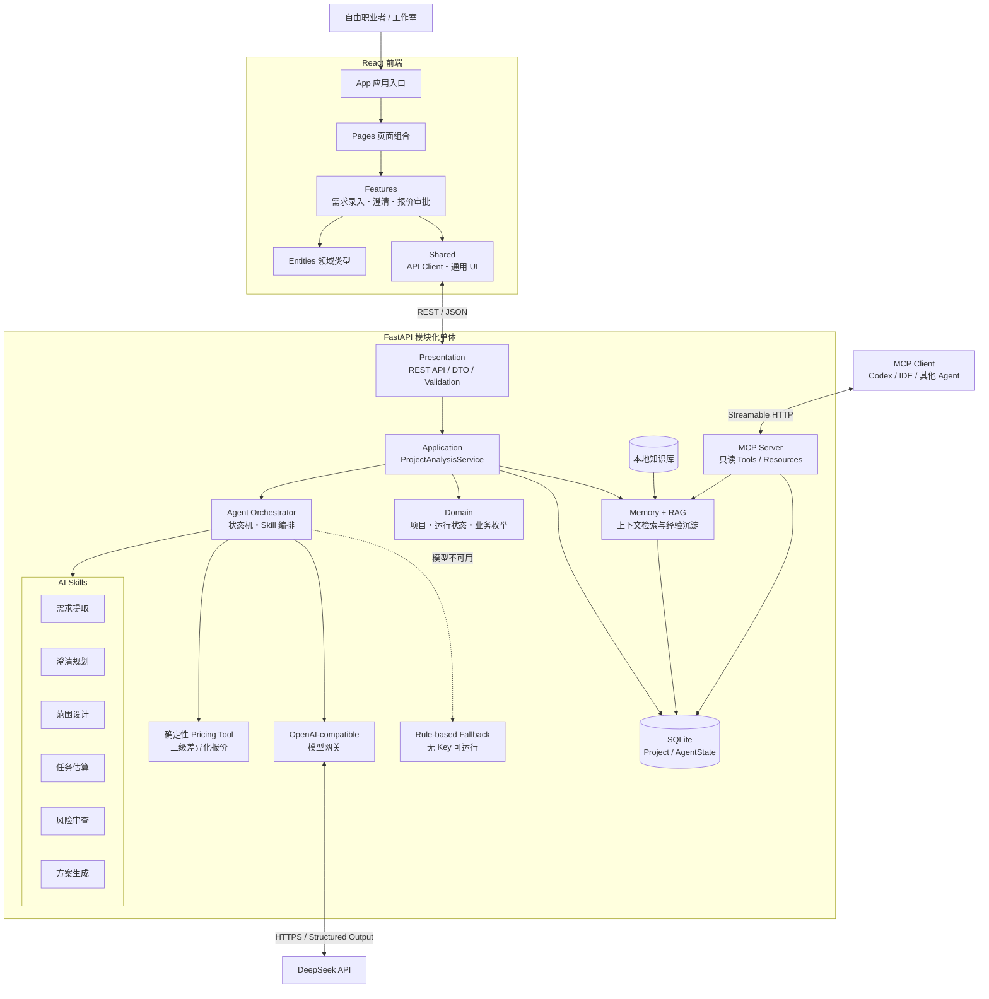
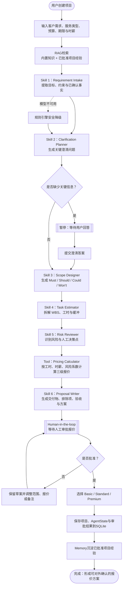

# 接单智策 - AI自由职业接单助手

接单智策面向自由职业者与小型工作室，目标是把客户的模糊描述转成可确认的需求、范围、任务、风险和报价草案。AI负责理解与建议，确定性工具负责金额计算，人类负责最终承诺。

## 当前状态

当前为`v0.5 Memory + RAG + MCP MVP`，已经跑通从需求澄清到差异化报价和人工确认的主链路：

- 后端模块化单体与清洁架构边界；
- Agent状态、工作流、Skill、Tool和模型端口；
- 六个版本化Skill Manifest；
- 前端Feature分层与领域类型；
- 可交互的项目录入、搜索筛选、Agent步骤与澄清回答界面；
- 项目、AgentRun和澄清提交API，以及无模型密钥可运行的规则回退；
- DeepSeek V4服务端网关、JSON结构化输出、重试、Schema校验和自动降级；
- 后端依赖规则、Skill Manifest、评测契约和API流程测试；
- 10个版本化接单评测案例；
- 六个Skill和报价Tool的严格Pydantic／TypeScript契约。
- SQLite项目与AgentState持久化，后端重启后可恢复；
- 本地中文／英文词法RAG，检索内置知识和已批准项目经验；
- 基于官方Python SDK的只读MCP Streamable HTTP服务；
- 范围、WBS、风险、确定性三级报价、方案和人工审批。

下一阶段重点是完整Trace、可重试Checkpoint、Eval Runner、用户测试和部署材料。

## 架构概览



选择模块化单体是为了兼顾工业级边界与5个开发日周期。模型、数据库、Trace和Tool可以替换，但MVP仍只需要一个前端和一个后端进程。

架构中的依赖方向由外向内：HTTP、SQLite、模型和MCP都是可替换的基础设施适配器，核心用例只依赖端口与领域契约。API Key只保存在后端环境变量中，前端不会直接访问模型服务。

## Agent工作流程



工作流采用“AI生成建议、确定性工具计算金额、人工承担最终承诺”的控制原则。运行状态会在`waiting_user`、`waiting_approval`和`completed`之间推进，关键节点均通过后端Schema校验并持久化，避免前后端状态不一致。

## 项目结构

```text
AI自由职业接单助手/
├─ backend/
│  ├─ app/
│  │  ├─ domain/             纯领域模型
│  │  ├─ application/        用例和外部端口
│  │  ├─ agent/              编排契约、工作流与Skills
│  │  ├─ infrastructure/     AI、存储、Trace和Tool插槽
│  │  ├─ presentation/       FastAPI HTTP适配层
│  │  ├─ bootstrap/          依赖装配
│  │  └─ core/               配置和错误
│  └─ tests/                 健康、依赖规则和Manifest测试
├─ frontend/
│  └─ src/
│     ├─ app/                应用入口
│     ├─ pages/              页面组合
│     ├─ features/           用户动作
│     ├─ entities/           稳定业务类型
│     └─ shared/             通用契约和UI
└─ docs/                     PRD、架构、进度和课程材料
```

## 本地启动

### 后端

```powershell
cd backend
python -m venv .venv
.venv\Scripts\Activate.ps1
pip install -r requirements-dev.txt
Copy-Item .env.example .env
uvicorn app.main:app --reload --port 8000
```

- 健康检查：`http://127.0.0.1:8000/api/health`
- API文档：`http://127.0.0.1:8000/docs`

### 前端

```powershell
cd frontend
npm install
npm run dev
```

前端地址：`http://127.0.0.1:5173`

## 架构验证

```powershell
cd backend
ruff check app tests
pytest

cd ..\frontend
npm run build
```

## 环境变量

复制`backend/.env.example`到`backend/.env`。真实密钥只放在本地`.env`或部署平台密钥管理中，不得提交Git。

```env
APP_AI_API_KEY=
APP_AI_BASE_URL=https://api.deepseek.com
APP_AI_MODEL=deepseek-v4-flash
APP_AI_MAX_RETRIES=1
APP_AI_MAX_TOKENS=4096
APP_AI_THINKING_ENABLED=false
APP_DATABASE_URL=sqlite:///./data/jiedan.db
APP_RAG_ENABLED=true
APP_RAG_TOP_K=3
APP_MCP_ENABLED=true
```

`APP_AI_API_KEY`为空时使用规则模式；配置Key并重启后端后，六个模型Skill调用DeepSeek。Key只由FastAPI读取，不得放入前端环境变量或网页表单。初始需求提取失败时使用规则Fallback，关键报价Skill失败时安全停止且不产生可批准报价。

项目和Agent状态保存在`backend/data/jiedan.db`。MCP客户端连接`http://127.0.0.1:8000/mcp/`，可调用`search_knowledge`、`list_projects`并读取`project://{project_id}`资源；当前MCP接口刻意保持只读。

## 文档导航

- [目标用户分析](docs/01-目标用户分析.md)
- [产品需求文档 PRD](docs/02-产品需求文档-PRD.md)
- [功能拆解与开发计划](docs/03-功能拆解与开发计划.md)
- [课程作业交付规划](docs/04-课程作业交付规划.md)
- [AI Native Agent架构与学习路线](docs/05-AI-Native-Agent架构与学习路线.md)
- [开发流程与项目进度表](docs/06-开发流程与项目进度表.md)
- [系统架构设计](docs/07-系统架构设计.md)
- [Prompt工程模板与作业记录规范](docs/08-Prompt工程模板与作业记录规范.md)
- [Prompt迭代记录模板](docs/templates/Prompt迭代记录模板.md)
- [P2评测与数据契约](docs/09-P2评测与数据契约.md)
- [项目Roadmap](docs/10-项目Roadmap.md)
- [DeepSeek接入与前后端密钥链路](docs/11-DeepSeek接入与前后端密钥链路.md)
- [AI Skill编排与差异化报价](docs/12-AI-Skill编排与差异化报价.md)
- [Memory、RAG与MCP实现说明](docs/13-Memory-RAG-MCP实现说明.md)
