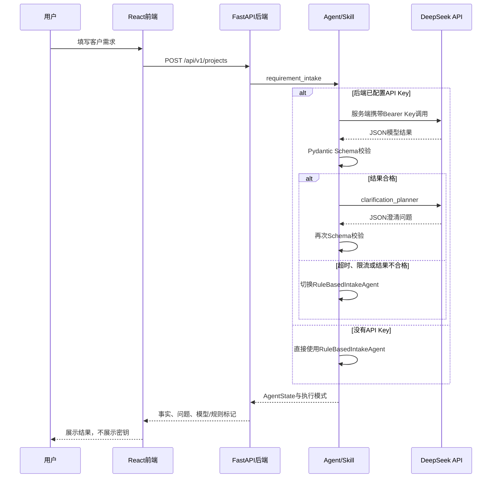

# DeepSeek接入与前后端密钥链路

版本：v1.0
更新日期：2026-08-19
适用阶段：P5-A

## 1. 最重要的结论

本项目采用“平台统一提供模型能力”的SaaS链路：

- API Key只保存在后端服务器的环境变量中；
- React前端不保存、不传输、不显示API Key；
- 普通用户只提交项目需求，不需要理解模型供应商；
- 没有Key时使用本地规则Fallback，产品仍然可以运行；
- 配置Key后，后端自动调用DeepSeek V4；
- 模型异常或输出不合格时，单次运行自动降级为规则模式。

## 2. 完整调用链路



## 3. 为什么不能在普通前端直接填写Key

浏览器不是可信密钥环境。只要Key进入前端，就可能出现在：

- 浏览器开发者工具的Network请求；
- JavaScript运行时和第三方脚本；
- 浏览器插件、本地存储或错误上报；
- 前端构建产物和公开源代码；
- 截图、录屏或共享电脑的自动填充记录。

因此本项目不提供普通用户API Key输入框，也不会使用`VITE_DEEPSEEK_API_KEY`之类的前端环境变量。Vite中以`VITE_`开头的变量会进入浏览器构建，不能保存服务端密钥。

## 4. 当前两种运行模式

### 4.1 规则模式

触发条件：

- `backend/.env`不存在；
- `APP_AI_API_KEY`为空；
- 模型名为空；
- 应用主动以测试配置启动。

效果：

- 不产生外部模型费用；
- 不向第三方发送客户文本；
- 使用确定性规则提取基本事实和服务类型问题；
- 前端顶部显示“规则模式”；
- 每个AgentRun记录`execution_mode=rule_fallback`。

### 4.2 DeepSeek模型模式

触发条件：后端同时存在非空的API Key和模型名。

效果：

- 需求提取和澄清规划调用DeepSeek；
- 使用JSON Output并把Pydantic JSON Schema加入系统提示词；
- 模型输出必须再次通过本地Schema校验；
- 记录模型名、Prompt版本、Token和耗时；
- 前端显示实际模型名称；
- 每个AgentRun记录`execution_mode=model`。

## 5. 本地配置步骤

第一步，复制环境变量模板：

```powershell
cd backend
Copy-Item .env.example .env
```

第二步，只在本地编辑`backend/.env`：

```env
APP_AI_API_KEY=你的DeepSeek API Key
APP_AI_BASE_URL=https://api.deepseek.com
APP_AI_MODEL=deepseek-v4-flash
APP_AI_TIMEOUT_SECONDS=30
APP_AI_MAX_RETRIES=1
APP_AI_MAX_TOKENS=4096
APP_AI_THINKING_ENABLED=false
```

第三步，重启FastAPI。环境变量只在进程启动时读取，修改`.env`后不重启不会生效。

第四步，打开健康检查：

```text
http://127.0.0.1:8000/api/health
```

正常配置后只会返回安全信息：

```json
{
  "status": "ok",
  "ai_mode": "model",
  "ai_model": "deepseek-v4-flash"
}
```

响应中永远不包含API Key。

## 6. 模型选择

课程开发阶段建议先使用：

```env
APP_AI_MODEL=deepseek-v4-flash
```

完成Prompt和Eval后，可以把最终评测配置改为：

```env
APP_AI_MODEL=deepseek-v4-pro
```

前端目前不允许普通用户切换模型。模型选择属于服务端运营配置，可以控制成本、稳定性和输出一致性。如果以后需要模型选择，前端只能提交后端允许的模型别名，例如`fast`或`quality`，由后端映射到真实模型名，不能让用户提交任意URL或密钥。

## 7. 自动降级规则

以下情况会触发规则Fallback：

- 请求超时或网络连接失败；
- DeepSeek返回429或5xx；
- DeepSeek拒绝请求；
- 返回空内容或非JSON内容；
- JSON因为Token限制被截断；
- 返回对象无法通过Pydantic Schema校验。

降级后前端会显示“模型降级 · 规则模式”。后端只返回通用原因，不把供应商响应正文、请求头或API Key发送给浏览器。

## 8. 如果未来做“用户自带Key”

“用户自带Key（BYOK）”是另一种产品模式，不应与当前课程MVP混在一起。若未来确实需要，至少要做到：

- 用户登录和租户隔离；
- Key只通过HTTPS发送到后端；
- 使用KMS或专用密钥服务加密保存；
- 前端回显时只显示掩码；
- 支持删除、轮换、权限审计和费用提醒；
- 严禁写入日志、Trace、数据库明文字段和错误响应；
- 每个租户只能使用自己的Key。

在没有上述能力前，课程MVP坚持使用项目维护者在部署平台配置的一把服务端Key。

## 9. 当前验证结果

已完成：

- 无Key规则模式的完整API与浏览器链路；
- 模型网关请求格式、服务端Authorization Header和JSON解析测试；
- 429／5xx重试测试；
- 模型结构化输出与Pydantic校验测试；
- 模型失败自动降级测试；
- 健康检查不泄露Key测试；
- 前后端模型状态字段与生产构建验证。
- DeepSeek V4 Flash线上真实调用成功；
- 单次创建流程完成两项模型Skill，记录到1729输入Token、1130输出Token和约10.7秒模型耗时；
- 模型生成7条确认事实和6个澄清问题；
- 浏览器完成“模型分析→展示问题→提交答案→澄清完成”，无控制台错误。

后续P5-B／P7完成：

- 10个固定案例的真实模型评测；
- Token成本、响应时间和Prompt质量记录；
- Flash与Pro的效果／成本对比。
